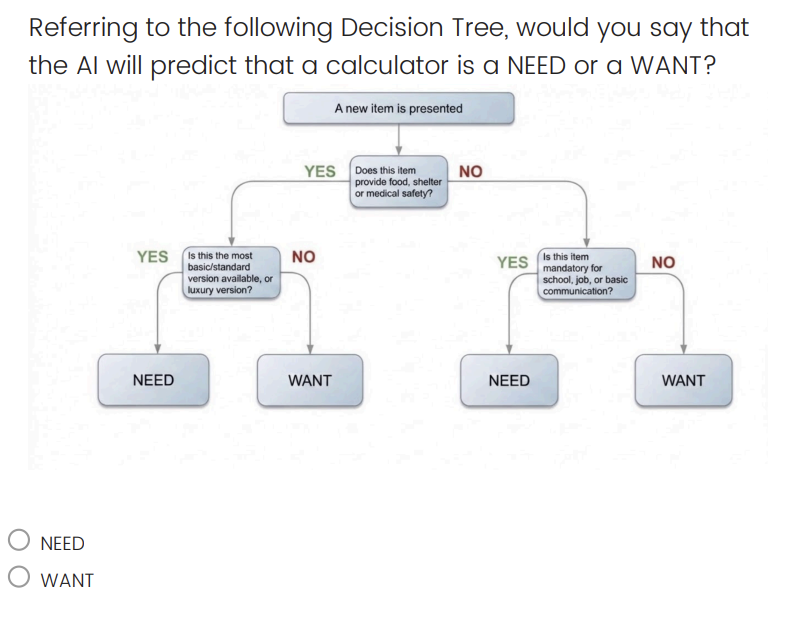

# WiseSpend AI Survey Questions

Here are some of the questions students saw before and after using WiseSpend AI. We removed names and other information that could identify anyone. This page is just here to show the questions; it is not a survey to fill out.

## A question students saw before and after playing

Students used this decision tree to decide whether the AI would call a calculator a Need or a Want.

## Questions students answered after playing

1. Students noticed that WiseSpend AI sometimes incorrectly labels school supplies as Wants instead of Needs. Which action could help improve the AI system?

   A. Stop collecting data from new users.  
   B. Improve the questions and rules used in the decision tree.  
   C. Remove all human input from the system.  
   D. Delete existing data and start from scratch.

2. Which statement about AI systems is true?

   A. AI systems always make good decisions.  
   B. AI systems can make mistakes if their rules or data are incomplete.  
   C. AI systems never depend on human intervention to generate predictions.  
   D. AI systems do not need to be updated after getting trained once.

3. Which statement best describes the role humans play in helping AI systems like WiseSpend improve?

   A. Humans only watch the AI operate, but do not influence its decisions.  
   B. Humans provide feedback and correct the AI's mistakes, helping it improve.  
   C. Humans are not needed because AI can learn by its own over time.  
   D. Humans program the AI once, and it does not need further input.

## Short-answer questions

1. Complete the statement: ``AI systems get better at making decisions when \_\_\_\_.''
2. Describe one example where an AI made a surprising or unexpected decision.
